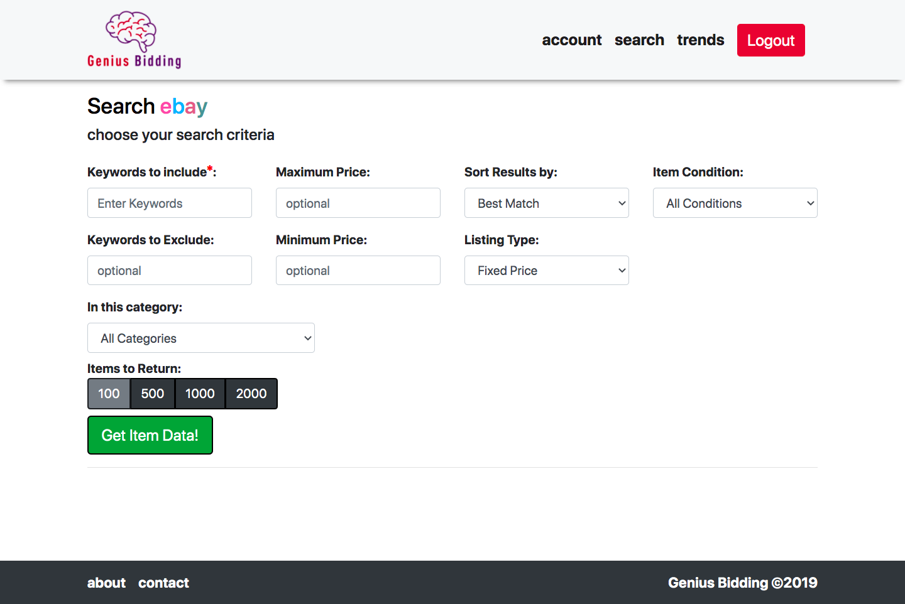
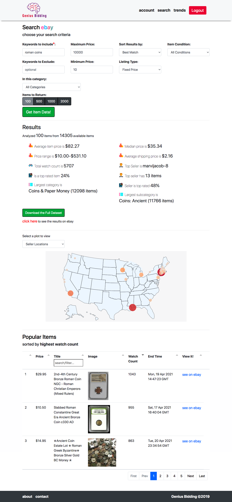
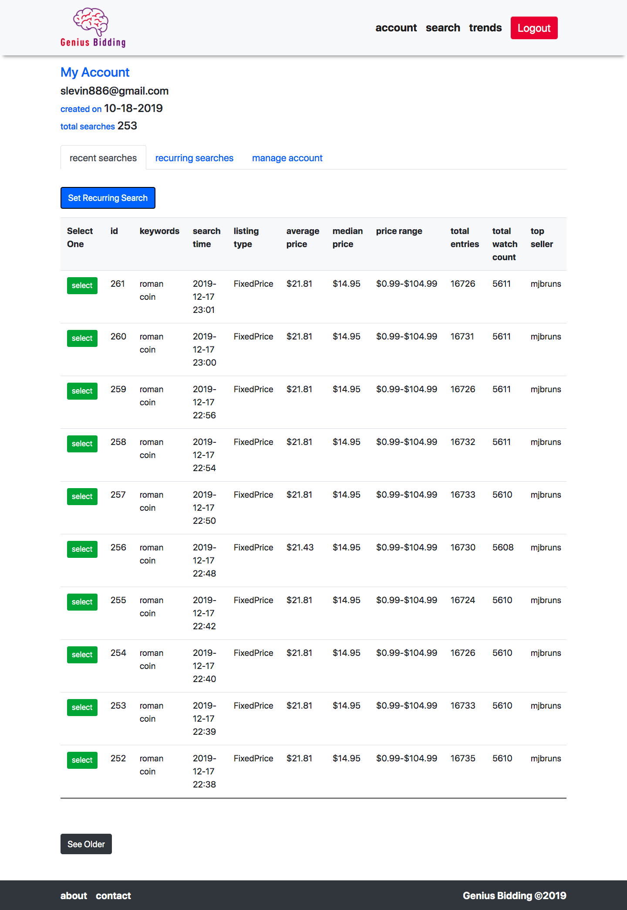

# Genius Bidding
## Web App to analyze market places on eBay

Functionality:
* Explore eBay market places using 9 item filters to get a variety of statistics, plots, datasets
  as well as photos and links to the most popular items. 
* Set specific searches to run at regular intervals to track statistics over time. 
* Track prices and market indicators through customized and automated search results. 
* Gain insights into top sellers, how they're marketing their products, and important trends.
* Download unique data sets with 50+ variables.
* User registration, authentication, and automated email notifications.

Note: if you are going to use Genius Bidding, make sure you abide by eBay's API [terms and conditions](https://developer.ebay.com/products/license).


### About Genius Bidding: 

I built Genius Bidding in 2019 as a personal project and hosted it on AWS elastic beanstalk for a couple of months. Backend is written in Python with vanilla JS, HTML, and CSS on the front.

When hosted, Genius Bidding used the following technologies:

* Flask, sqlAlchemy
* PostgreSQL
* AWS: S3, Elastic Beanstalk, Route 53, RDS
* cron - for running recurring searches
* Sentry

## The UI

### Landing Page


### Search Page


### Search Page w/ Results


### Account Page w/ search history


### Trends Page


### Login Page


## To run locally: 

Set the following ENV variables: 

```
export APP_SETTINGS=development
export EBAY_API="YOUR_EBAY_API_KEY"
export FLASK_ENV=development
export SECRET_KEY="A_SECRET_KEY_FOR_FLASE"
export DATABASE_URL="postgresql://localhost/ebay_research" # set up your local DB
export FLASK_APP=run.py
export MAIL_USERNAME=your_email@gmail.com
export MAIL_PASSWORD=email_password
export MAIL_SERVER=smtp.gmail.com
export MAIL_USE_TLS=1
export MAIL_PORT=587
export MAIL_DEFAULT_SENDER=your_email@gmail.com
export AWS_SECRET_ACCESS_KEY=SECRET_KEY_IF_USING_AWS
export AWS_ACCESS_KEY_ID=AWS_ACCESS_KEY_IF_USING
export S3_DIRECTORY=S3_DIRECTORY_IF_USING
```